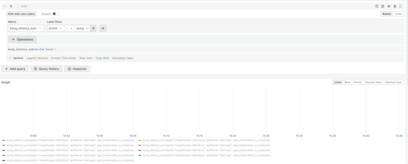

## Common monitoring indicators for gateways
### 1.kong_http_status gateway response HTTP CODE result
Parameter Description ：
---
 | Parameters           | Description                                                                           | 
 |----------------------|---------------------------------------------------------------------------------------|
 | apiId                | The CR name of snapshotapis                                                           |
 | apiName              | The display name of the annotations.tamp/displayNames API for snapshotapis            |
 | code                 | Request response code                                                                 |
 | consumer             | The name of the requested consumer                                                    |
 | credential           | The requested credential information, such as the username of basic auth              |
 | envId                | The name of the published gateway environment and kongingress                         |
 | envName              | DisplayNames display name of the published gateway                                    |
 | groupId              | The CR name of the apigroup to which snapshotapis belong                              |
 | groupName            | The display name of the apigroup to which snapshotapis belong                         |
 | kubernetes_namespace | The namespace to which the published gateway environment belongs                      |
 | kubernetes_pod_name  | The pod name of the kong_proxy for the published gateway environment                  |
 | model                | AI request parameter model                                                            |
 | namespace            | The namespace to which snapshotapis belong                                            |
 | remoteAddr           | Caller IP                                                                             |
 | route                | The routing naming convention for APIs is ${namepsace}.${apiId}-${envId}.00           |
 | service              | The naming convention for API services is ${namepsace}.${svcname}.pnum-${serviceport} |
 | system_appName       | The name of the published gateway environment and kongingress                         |
 | userAgent            | Client                                                                                |
---

Example：
```bash
kong_http_status
{
apiId="snapshotapi-n85v0p1p", #The CR name of snapshotapis
apiName="demoapi",  # The display name of the annotations.tamp/displayNames API for snapshotapis
app_kubernetes_io_component="app",
app_kubernetes_io_instance="kong",
app_kubernetes_io_managed_by="Helm",
app_kubernetes_io_name="kong",
app_kubernetes_io_version="2.5",
code="200", # Request response code
consumer="demo0123", # The name of the requested consumer
credential="demo0123",# The requested credential information, such as the username of basic auth 
envId="kong", # The name of the published gateway environment and kongingress
envName="globalmarket",  # DisplayNames display name of the published gateway
groupId="apigroups-crwfdp", # The CR name of the apigroup to which snapshotapis belong
groupName="demo", # The display name of the apigroup to which snapshotapis belong
helm_sh_chart="kong-2.4.0",
instance="3173740xd125",
istio_injection_not_allow_access_mesh="true",
job="kubernetes-pods",
konghq_com_component="kong-proxy",
kubernetes_namespace="kong-system",# The namespace to which the published gateway environment belongs 
kubernetes_pod_name="kong-proxy-kong-688f6cf487-mxjx8",# The pod name of the kong_proxy for the published gateway environment
model="98aa6883-16f9-4752-9601-c90d1b3e138a",# AI request parameter model  
namespace="kubeagi-system", # The namespace to which snapshotapis belong
pod_template_hash="688f6cf487",
remoteAddr="172.31.58.162",# Caller IP
route="kubeagi-system.snapshotapi-n85v0p1p-kong.00",# The routing naming convention for APIs is ${namepsace}.${apiId}-${envId}.00
service="kubeagi-system.arcadia-fastchat.pnum-8000",# The naming convention for API services is ${namepsace}.${svcname}.pnum-${serviceport}
system_appName="kong", # The name of the published gateway environment and kongingress     
userAgent="Go-http-client/1.1"  #Client
}
```
### 2.kong_bandwidth The total bandwidth consumed by each service/route in bytes
Parameter Description ：
---
| Parameters           | Description                                                                           | 
|----------------------|---------------------------------------------------------------------------------------|
| apiId                | The CR name of snapshotapis                                                           |
| apiName              | The display name of the annotations.tamp/displayNames API for snapshotapis            |
| type                 | There are types of inbound and outbound addresses                                      |
| consumer             | The name of the requested consumer                                                    |
| credential           | The requested credential information, such as the username of basic auth              |
| envId                | The name of the published gateway environment and kongingress                         |
| envName              | DisplayNames display name of the published gateway                                    |
| groupId              | The CR name of the apigroup to which snapshotapis belong                              |
| groupName            | The display name of the apigroup to which snapshotapis belong                         |
| kubernetes_namespace | The namespace to which the published gateway environment belongs                      |
| kubernetes_pod_name  | The pod name of the kong_proxy for the published gateway environment                  |
| model                | AI request parameter model                                                            |
| namespace            | The namespace to which snapshotapis belong                                            |
| remoteAddr           | Caller IP                                                                             |
| route                | The routing naming convention for APIs is ${namepsace}.${apiId}-${envId}.00           |
| service              | The naming convention for API services is ${namepsace}.${svcname}.pnum-${serviceport} |
| system_appName       | The name of the published gateway environment and kongingress                         |
| userAgent            | Client                                                                                |
---

Example：
```bash
kong_bandwidth
{
apiId="snapshotapi-n85v0p1p", #The CR name of snapshotapis
apiName="demoapi",  # The display name of the annotations.tamp/displayNames API for snapshotapis
app_kubernetes_io_component="app",
app_kubernetes_io_instance="kong",
app_kubernetes_io_managed_by="Helm",
app_kubernetes_io_name="kong",
app_kubernetes_io_version="2.5",
consumer="demo0123", # The name of the requested consumer
credential="demo0123",# The requested credential information, such as the username of basic auth 
envId="kong", # The name of the published gateway environment and kongingress
envName="globalmarket",  # DisplayNames display name of the published gateway
groupId="apigroups-crwfdp", # The CR name of the apigroup to which snapshotapis belong
groupName="demo", # The display name of the apigroup to which snapshotapis belong
helm_sh_chart="kong-2.4.0",
instance="3173740xd125",
istio_injection_not_allow_access_mesh="true",
job="kubernetes-pods",
konghq_com_component="kong-proxy",
kubernetes_namespace="kong-system",# The namespace to which the published gateway environment belongs 
kubernetes_pod_name="kong-proxy-kong-688f6cf487-mxjx8",# The pod name of the kong_proxy for the published gateway environment
model="98aa6883-16f9-4752-9601-c90d1b3e138a",# AI request parameter model  
namespace="kubeagi-system", # The namespace to which snapshotapis belong
pod_template_hash="688f6cf487",
remoteAddr="172.31.58.162",# Caller IP
route="kubeagi-system.snapshotapi-n85v0p1p-kong.00",# The routing naming convention for APIs is ${namepsace}.${apiId}-${envId}.00
service="kubeagi-system.arcadia-fastchat.pnum-8000",# The naming convention for API services is ${namepsace}.${svcname}.pnum-${serviceport}
system_appName="kong", # The name of the published gateway environment and kongingress     
userAgent="Go-http-client/1.1",  #Client
type="ingress" #There are types of inbound and outbound addresses
}
```
### 3.kong_latency_count  The delay added by Kong, the total request time for each service/route in Kong, and the total number of upstream service delays
Parameter Description ：
---
| Parameters           | Description                                                                           | 
|----------------------|---------------------------------------------------------------------------------------|
| apiId                | The CR name of snapshotapis                                                           |
| apiName              | The display name of the annotations.tamp/displayNames API for snapshotapis            |
| type                 | There are three types of request:requests, Kong Gateway and Upstream Source Service   |
| consumer             | The name of the requested consumer                                                    |
| credential           | The requested credential information, such as the username of basic auth              |
| envId                | The name of the published gateway environment and kongingress                         |
| envName              | DisplayNames display name of the published gateway                                    |
| groupId              | The CR name of the apigroup to which snapshotapis belong                              |
| groupName            | The display name of the apigroup to which snapshotapis belong                         |
| kubernetes_namespace | The namespace to which the published gateway environment belongs                      |
| kubernetes_pod_name  | The pod name of the kong_proxy for the published gateway environment                  |
| model                | AI request parameter model                                                            |
| namespace            | The namespace to which snapshotapis belong                                            |
| remoteAddr           | Caller IP                                                                             |
| route                | The routing naming convention for APIs is ${namepsace}.${apiId}-${envId}.00           |
| service              | The naming convention for API services is ${namepsace}.${svcname}.pnum-${serviceport} |
| system_appName       | The name of the published gateway environment and kongingress                         |
| userAgent            | Client                                                                                |
---

Example：
```bash
kong_latency_count
{
apiId="snapshotapi-n85v0p1p", #The CR name of snapshotapis
apiName="demoapi",  # The display name of the annotations.tamp/displayNames API for snapshotapis
app_kubernetes_io_component="app",
app_kubernetes_io_instance="kong",
app_kubernetes_io_managed_by="Helm",
app_kubernetes_io_name="kong",
app_kubernetes_io_version="2.5",
consumer="demo0123", # The name of the requested consumer
credential="demo0123",# The requested credential information, such as the username of basic auth 
envId="kong", # The name of the published gateway environment and kongingress
envName="globalmarket",  # DisplayNames display name of the published gateway
groupId="apigroups-crwfdp", # The CR name of the apigroup to which snapshotapis belong
groupName="demo", # The display name of the apigroup to which snapshotapis belong
helm_sh_chart="kong-2.4.0",
instance="3173740xd125",
istio_injection_not_allow_access_mesh="true",
job="kubernetes-pods",
konghq_com_component="kong-proxy",
kubernetes_namespace="kong-system",# The namespace to which the published gateway environment belongs 
kubernetes_pod_name="kong-proxy-kong-688f6cf487-mxjx8",# The pod name of the kong_proxy for the published gateway environment
model="98aa6883-16f9-4752-9601-c90d1b3e138a",# AI request parameter model  
namespace="kubeagi-system", # The namespace to which snapshotapis belong
pod_template_hash="688f6cf487",
remoteAddr="172.31.58.162",# Caller IP
route="kubeagi-system.snapshotapi-n85v0p1p-kong.00",# The routing naming convention for APIs is ${namepsace}.${apiId}-${envId}.00
service="kubeagi-system.arcadia-fastchat.pnum-8000",# The naming convention for API services is ${namepsace}.${svcname}.pnum-${serviceport}
system_appName="kong", # The name of the published gateway environment and kongingress     
userAgent="Go-http-client/1.1",  #Client
type="request"# There are three types of request:requests, Kong Gateway and Upstream Source Service
}
```
### 4.kong_latency_sum  The delay added by Kong, the total request time for each service/route in Kong, and the total delay time for upstream services
Parameter Description ：
---
| Parameters           | Description                                                                           | 
|----------------------|---------------------------------------------------------------------------------------|
| apiId                | The CR name of snapshotapis                                                           |
| apiName              | The display name of the annotations.tamp/displayNames API for snapshotapis            |
| type                 | There are three types of request:requests, Kong Gateway and Upstream Source Service   |
| consumer             | The name of the requested consumer                                                    |
| credential           | The requested credential information, such as the username of basic auth              |
| envId                | The name of the published gateway environment and kongingress                         |
| envName              | DisplayNames display name of the published gateway                                    |
| groupId              | The CR name of the apigroup to which snapshotapis belong                              |
| groupName            | The display name of the apigroup to which snapshotapis belong                         |
| kubernetes_namespace | The namespace to which the published gateway environment belongs                      |
| kubernetes_pod_name  | The pod name of the kong_proxy for the published gateway environment                  |
| model                | AI request parameter model                                                            |
| namespace            | The namespace to which snapshotapis belong                                            |
| remoteAddr           | Caller IP                                                                             |
| route                | The routing naming convention for APIs is ${namepsace}.${apiId}-${envId}.00           |
| service              | The naming convention for API services is ${namepsace}.${svcname}.pnum-${serviceport} |
| system_appName       | The name of the published gateway environment and kongingress                         |
| userAgent            | Client                                                                                |
---

Example：
```bash
kong_latency_sum
{
apiId="snapshotapi-n85v0p1p", #The CR name of snapshotapis
apiName="demoapi",  # The display name of the annotations.tamp/displayNames API for snapshotapis
app_kubernetes_io_component="app",
app_kubernetes_io_instance="kong",
app_kubernetes_io_managed_by="Helm",
app_kubernetes_io_name="kong",
app_kubernetes_io_version="2.5",
consumer="demo0123", # The name of the requested consumer
credential="demo0123",# The requested credential information, such as the username of basic auth 
envId="kong", # The name of the published gateway environment and kongingress
envName="globalmarket",  # DisplayNames display name of the published gateway
groupId="apigroups-crwfdp", # The CR name of the apigroup to which snapshotapis belong
groupName="demo", # The display name of the apigroup to which snapshotapis belong
helm_sh_chart="kong-2.4.0",
instance="3173740xd125",
istio_injection_not_allow_access_mesh="true",
job="kubernetes-pods",
konghq_com_component="kong-proxy",
kubernetes_namespace="kong-system",# The namespace to which the published gateway environment belongs 
kubernetes_pod_name="kong-proxy-kong-688f6cf487-mxjx8",# The pod name of the kong_proxy for the published gateway environment
model="98aa6883-16f9-4752-9601-c90d1b3e138a",# AI request parameter model  
namespace="kubeagi-system", # The namespace to which snapshotapis belong
pod_template_hash="688f6cf487",
remoteAddr="172.31.58.162",# Caller IP
route="kubeagi-system.snapshotapi-n85v0p1p-kong.00",# The routing naming convention for APIs is ${namepsace}.${apiId}-${envId}.00
service="kubeagi-system.arcadia-fastchat.pnum-8000",# The naming convention for API services is ${namepsace}.${svcname}.pnum-${serviceport}
system_appName="kong", # The name of the published gateway environment and kongingress     
userAgent="Go-http-client/1.1",  #Client
type="request"# There are three types of request:requests, Kong Gateway and Upstream Source Service
}
```
### 5.kong_completion_tokens AI return word token metric
Parameter Description ：
---
| Parameters           | Description                                                                           | 
|----------------------|---------------------------------------------------------------------------------------|
| apiId                | The CR name of snapshotapis                                                           |
| apiName              | The display name of the annotations.tamp/displayNames API for snapshotapis            |
| consumer             | The name of the requested consumer                                                    |
| credential           | The requested credential information, such as the username of basic auth              |
| envId                | The name of the published gateway environment and kongingress                         |
| envName              | DisplayNames display name of the published gateway                                    |
| groupId              | The CR name of the apigroup to which snapshotapis belong                              |
| groupName            | The display name of the apigroup to which snapshotapis belong                         |
| kubernetes_namespace | The namespace to which the published gateway environment belongs                      |
| kubernetes_pod_name  | The pod name of the kong_proxy for the published gateway environment                  |
| model                | AI request parameter model                                                            |
| namespace            | The namespace to which snapshotapis belong                                            |
| remoteAddr           | Caller IP                                                                             |
| route                | The routing naming convention for APIs is ${namepsace}.${apiId}-${envId}.00           |
| service              | The naming convention for API services is ${namepsace}.${svcname}.pnum-${serviceport} |
| system_appName       | The name of the published gateway environment and kongingress                         |
| userAgent            | Client                                                                                |
---

Example：
```bash
kong_completion_tokens
{apiId="snapshotapi-n85v0p1p", #The CR name of snapshotapis
apiName="demoapi",  # The display name of the annotations.tamp/displayNames API for snapshotapis
app_kubernetes_io_component="app",
app_kubernetes_io_instance="kong",
app_kubernetes_io_managed_by="Helm",
app_kubernetes_io_name="kong",
app_kubernetes_io_version="2.5",
consumer="demo0123", # The name of the requested consumer
credential="demo0123",# The requested credential information, such as the username of basic auth 
envId="kong", # The name of the published gateway environment and kongingress
envName="globalmarket",  # DisplayNames display name of the published gateway
groupId="apigroups-crwfdp", # The CR name of the apigroup to which snapshotapis belong
groupName="demo", # The display name of the apigroup to which snapshotapis belong
helm_sh_chart="kong-2.4.0",
instance="3173740xd125",
istio_injection_not_allow_access_mesh="true",
job="kubernetes-pods",
konghq_com_component="kong-proxy",
kubernetes_namespace="kong-system",# The namespace to which the published gateway environment belongs 
kubernetes_pod_name="kong-proxy-kong-688f6cf487-mxjx8",# The pod name of the kong_proxy for the published gateway environment
model="98aa6883-16f9-4752-9601-c90d1b3e138a",# AI request parameter model  
namespace="kubeagi-system", # The namespace to which snapshotapis belong
pod_template_hash="688f6cf487",
remoteAddr="172.31.58.162",# Caller IP
route="kubeagi-system.snapshotapi-n85v0p1p-kong.00",# The routing naming convention for APIs is ${namepsace}.${apiId}-${envId}.00
service="kubeagi-system.arcadia-fastchat.pnum-8000",# The naming convention for API services is ${namepsace}.${svcname}.pnum-${serviceport}
system_appName="kong", # The name of the published gateway environment and kongingress     
userAgent="Go-http-client/1.1",  #Client
type="kong" 
}
```
### 6.kong_total_tokens AI total token metric
Parameter Description ：
---
| Parameters           | Description                                                                           | 
|----------------------|---------------------------------------------------------------------------------------|
| apiId                | The CR name of snapshotapis                                                           |
| apiName              | The display name of the annotations.tamp/displayNames API for snapshotapis            |
| consumer             | The name of the requested consumer                                                    |
| credential           | The requested credential information, such as the username of basic auth              |
| envId                | The name of the published gateway environment and kongingress                         |
| envName              | DisplayNames display name of the published gateway                                    |
| groupId              | The CR name of the apigroup to which snapshotapis belong                              |
| groupName            | The display name of the apigroup to which snapshotapis belong                         |
| kubernetes_namespace | The namespace to which the published gateway environment belongs                      |
| kubernetes_pod_name  | The pod name of the kong_proxy for the published gateway environment                  |
| model                | AI request parameter model                                                            |
| namespace            | The namespace to which snapshotapis belong                                            |
| remoteAddr           | Caller IP                                                                             |
| route                | The routing naming convention for APIs is ${namepsace}.${apiId}-${envId}.00           |
| service              | The naming convention for API services is ${namepsace}.${svcname}.pnum-${serviceport} |
| system_appName       | The name of the published gateway environment and kongingress                         |
| userAgent            | Client                                                                                |
---

Example：
```bash
kong_total_tokens
{apiId="snapshotapi-n85v0p1p", #The CR name of snapshotapis
apiName="demoapi",  # The display name of the annotations.tamp/displayNames API for snapshotapis
app_kubernetes_io_component="app",
app_kubernetes_io_instance="kong",
app_kubernetes_io_managed_by="Helm",
app_kubernetes_io_name="kong",
app_kubernetes_io_version="2.5",
consumer="demo0123", # The name of the requested consumer
credential="demo0123",# The requested credential information, such as the username of basic auth 
envId="kong", # The name of the published gateway environment and kongingress
envName="globalmarket",  # DisplayNames display name of the published gateway
groupId="apigroups-crwfdp", # The CR name of the apigroup to which snapshotapis belong
groupName="demo", # The display name of the apigroup to which snapshotapis belong
helm_sh_chart="kong-2.4.0",
instance="3173740xd125",
istio_injection_not_allow_access_mesh="true",
job="kubernetes-pods",
konghq_com_component="kong-proxy",
kubernetes_namespace="kong-system",# The namespace to which the published gateway environment belongs 
kubernetes_pod_name="kong-proxy-kong-688f6cf487-mxjx8",# The pod name of the kong_proxy for the published gateway environment
model="98aa6883-16f9-4752-9601-c90d1b3e138a",# AI request parameter model  
namespace="kubeagi-system", # The namespace to which snapshotapis belong
pod_template_hash="688f6cf487",
remoteAddr="172.31.58.162",# Caller IP
route="kubeagi-system.snapshotapi-n85v0p1p-kong.00",# The routing naming convention for APIs is ${namepsace}.${apiId}-${envId}.00
service="kubeagi-system.arcadia-fastchat.pnum-8000",# The naming convention for API services is ${namepsace}.${svcname}.pnum-${serviceport}
system_appName="kong", # The name of the published gateway environment and kongingress     
userAgent="Go-http-client/1.1",  #Client
type="kong" 
}
```
### 7.kong_prompt_tokens AI request token metric
Parameter Description ：
---
| Parameters           | Description                                                                           | 
|----------------------|---------------------------------------------------------------------------------------|
| apiId                | The CR name of snapshotapis                                                           |
| apiName              | The display name of the annotations.tamp/displayNames API for snapshotapis            |
| consumer             | The name of the requested consumer                                                    |
| credential           | The requested credential information, such as the username of basic auth              |
| envId                | The name of the published gateway environment and kongingress                         |
| envName              | DisplayNames display name of the published gateway                                    |
| groupId              | The CR name of the apigroup to which snapshotapis belong                              |
| groupName            | The display name of the apigroup to which snapshotapis belong                         |
| kubernetes_namespace | The namespace to which the published gateway environment belongs                      |
| kubernetes_pod_name  | The pod name of the kong_proxy for the published gateway environment                  |
| model                | AI request parameter model                                                            |
| namespace            | The namespace to which snapshotapis belong                                            |
| remoteAddr           | Caller IP                                                                             |
| route                | The routing naming convention for APIs is ${namepsace}.${apiId}-${envId}.00           |
| service              | The naming convention for API services is ${namepsace}.${svcname}.pnum-${serviceport} |
| system_appName       | The name of the published gateway environment and kongingress                         |
| userAgent            | Client                                                                                |
---

Example：
```bash
kong_prompt_tokens
{apiId="snapshotapi-n85v0p1p", #The CR name of snapshotapis
apiName="demoapi",  # The display name of the annotations.tamp/displayNames API for snapshotapis
app_kubernetes_io_component="app",
app_kubernetes_io_instance="kong",
app_kubernetes_io_managed_by="Helm",
app_kubernetes_io_name="kong",
app_kubernetes_io_version="2.5",
consumer="demo0123", # The name of the requested consumer
credential="demo0123",# The requested credential information, such as the username of basic auth 
envId="kong", # The name of the published gateway environment and kongingress
envName="globalmarket",  # DisplayNames display name of the published gateway
groupId="apigroups-crwfdp", # The CR name of the apigroup to which snapshotapis belong
groupName="demo", # The display name of the apigroup to which snapshotapis belong
helm_sh_chart="kong-2.4.0",
instance="3173740xd125",
istio_injection_not_allow_access_mesh="true",
job="kubernetes-pods",
konghq_com_component="kong-proxy",
kubernetes_namespace="kong-system",# The namespace to which the published gateway environment belongs 
kubernetes_pod_name="kong-proxy-kong-688f6cf487-mxjx8",# The pod name of the kong_proxy for the published gateway environment
model="98aa6883-16f9-4752-9601-c90d1b3e138a",# AI request parameter model  
namespace="kubeagi-system", # The namespace to which snapshotapis belong
pod_template_hash="688f6cf487",
remoteAddr="172.31.58.162",# Caller IP
route="kubeagi-system.snapshotapi-n85v0p1p-kong.00",# The routing naming convention for APIs is ${namepsace}.${apiId}-${envId}.00
service="kubeagi-system.arcadia-fastchat.pnum-8000",# The naming convention for API services is ${namepsace}.${svcname}.pnum-${serviceport}
system_appName="kong", # The name of the published gateway environment and kongingress     
userAgent="Go-http-client/1.1",  #Client
type="kong" 
}
```
#### Additional explanation:
You can retrieve all indicators and their descriptions by querying the SVC of Kong proxy to curl its interface
For example:
```bash
#kubectl get svc -nkong-system
#curl http://10.99.162.75:9542/metrics
```
